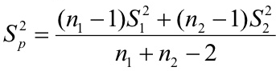
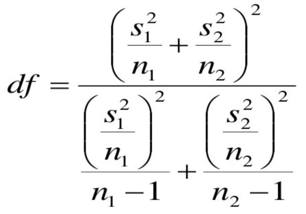

# Semana 3
[Estimación (youtube)](https://youtu.be/xoEb243ZE8g)

[Ejercicio sobre probabilidad](ejercicio1.md)

[Estimación por intervalos de confianza](teointervalos.pdf)

[Distribución muestral (youtube)](https://youtu.be/xQgULhwpDJM)

[Estimación de una media para muestras grandes (youtube)](https://youtu.be/N45PNGGbYp8)

Cuando las varianzas son iguales, hay que ponderarlas con la siguiente fórmula:

[Estimación de una media para muestras pequeñas (youtube)](https://youtu.be/XEHRwidsiGQ)

Cuando las varianzas son diferentes.

[Estimación de proporciones (youtube)](https://youtu.be/WqbxgQzJPiI)

[Tarea estimación](tareaEstimacion.md)

[Regla de Decisión](https://youtu.be/mgPnrAjlyss)

[Tablas estadísticas para variables discretas](Tablas_Distribuciones_Var_discretas.pdf)

[Tablas estadísticas para variables continuas](tablas.pdf)
